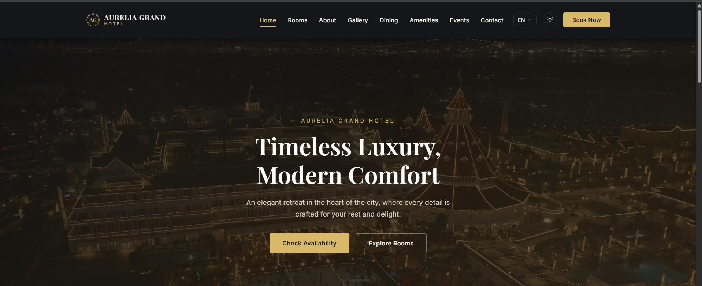

<div align="center">

# 🏨 AURELIA GRAND HOTEL

### ✦ Timeless Luxury. Modern Comfort. ✦

<p>
A premium responsive luxury hotel website designed with
an elegant dark interface and sophisticated gold accents.
</p>

<br>

<a href="https://waheed-web.github.io/Aurelia-Grand-Hotel/">

</a>

<br><br>

<a href="https://waheed-web.github.io/Aurelia-Grand-Hotel/">

</a>

</div>

---

## 🏨 About

**Aurelia Grand Hotel** is a modern luxury hotel website
created to provide an elegant and immersive digital
hospitality experience.

The project combines premium visual design with responsive
frontend development, interactive navigation, hotel services,
dining, events, galleries, and multilingual support.

---

## ✨ Features

- 🏨 Luxury hotel homepage
- 🛏️ Rooms & accommodation
- 🍽️ Dining experience
- 🖼️ Hotel gallery
- 💎 Amenities
- 🎉 Events
- 📞 Contact section
- 🌐 Multi-language support
- 📱 Responsive design
- ✨ Modern interactive UI

---

## 🛠️ Technologies

| Technology | Purpose |
|---|---|
| HTML5 | Website structure |
| CSS3 | Styling & responsive design |
| JavaScript | Interactions & functionality |

---

## 📂 Project Structure

```text
Aurelia-Grand-Hotel/
│
├── css/
│   ├── style.css
│   └── sketchbook.css
│
├── js/
│   ├── main.js
│   ├── sketchbook.js
│   └── translations.js
│
├── index.html
├── about.html
├── amenities.html
├── contact.html
├── dining.html
├── events.html
├── gallery.html
├── rooms.html
│
├── website-preview.png
└── README.md
